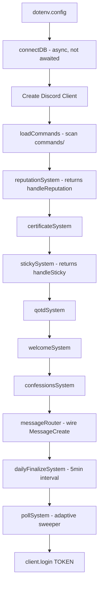
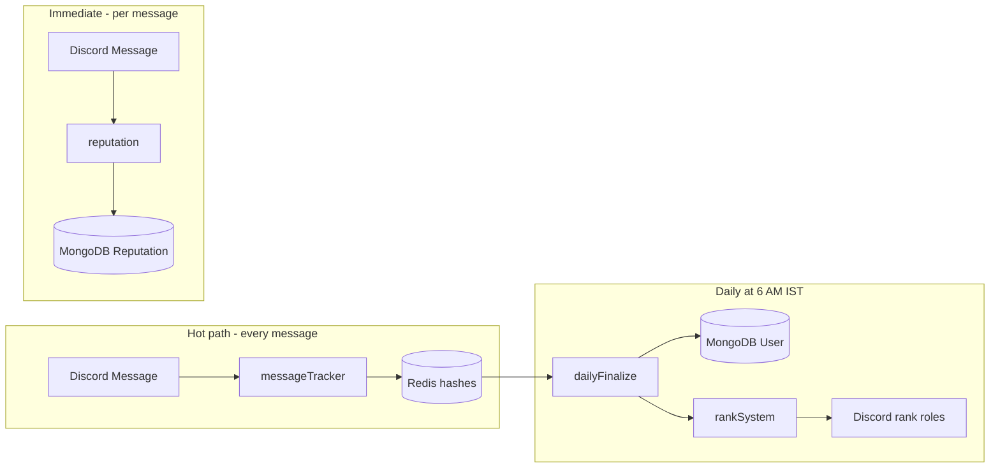
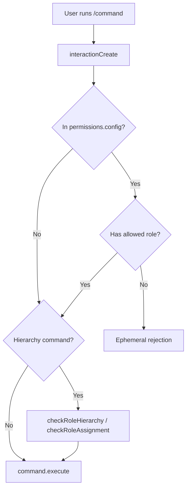

# Architecture

This document explains how the r/alevel Discord bot is structured, how it starts up, and how its components communicate.

---

## Overview

The bot is a **single-process Node.js application**. There is no microservice split, no separate `events/` or `jobs/` folders, and no message queue. Everything runs in one `node index.js` process.

| Layer | Location | Responsibility |
|-------|----------|----------------|
| Entry point | `index.js` | Boot orchestration |
| Commands | `commands/` | User-facing slash command handlers |
| Systems | `systems/` | Event listeners, schedulers, feature logic |
| Models | `models/` | Mongoose schemas (MongoDB) |
| Utils | `utils/` | Shared helpers |
| Config | `permissions.config.js`, `.env` | Access control and IDs |
| Infrastructure | `database.js`, `redis.js` | DB connections |

**External services at runtime:** Discord Gateway + REST API only. No OpenAI, Stripe, or other third-party APIs in the main bot process.

---

## Project structure

```
r-alevel bot code/
├── index.js                 # Entry point — boot all systems
├── database.js              # MongoDB connect + counter seeding
├── redis.js                 # Singleton ioredis client
├── permissions.config.js    # Role → command permission map
├── package.json
├── Dockerfile
├── .env.example
│
├── commands/                # 72 slash commands in 13 category folders
│   ├── applications/
│   ├── certificates/
│   ├── confessions/
│   ├── fun/
│   ├── helper/
│   ├── moderation/
│   ├── reputation/
│   ├── secondweb/
│   ├── sethelper/
│   ├── sticky/
│   ├── task/
│   ├── utility/
│   └── web/
│
├── systems/                 # 12 background/event modules
│   ├── commands.js          # Slash command loader + router
│   ├── messageRouter.js     # Central MessageCreate dispatcher
│   ├── messageTracker.js    # Redis message counters
│   ├── reputation.js        # Thank-you rep system
│   ├── sticky.js            # Sticky message reposter
│   ├── dailyFinalizeSystem.js
│   ├── rankSystem.js        # XP rank roles (via finalize)
│   ├── qotd.js              # QOTD reminder scheduler
│   ├── polls.js             # Poll vote/view button handlers
│   ├── welcome.js           # Welcome card on join
│   ├── certificates.js      # Certificate button/modal flow
│   └── confessions.js       # Confession approval flow
│
├── models/                  # 18 Mongoose schemas
├── utils/                   # 22 helper modules
├── scripts/                 # Deploy, migration, verification
├── config/
│   └── constants.js         # Legacy hardcoded IDs (DO NOT DELETE)
└── assets/
    └── welcome.png          # Welcome card background image
```

---

## Startup flow

When you run `node index.js`, this sequence executes:



### Step-by-step

**1. Load environment**

```javascript
require("dotenv").config();
```

**2. Connect MongoDB** (fire-and-forget — not awaited)

```javascript
connectDB(); // database.js — connects + seeds counters
```

**3. Create Discord client** with four intents:

```javascript
const client = new Client({
  intents: [
    GatewayIntentBits.Guilds,
    GatewayIntentBits.GuildMembers,
    GatewayIntentBits.GuildMessages,
    GatewayIntentBits.MessageContent,
  ],
});
```

| Intent | Why needed |
|--------|------------|
| `Guilds` | Server events, slash commands |
| `GuildMembers` | Welcome system, role checks, member fetch |
| `GuildMessages` | Message tracking, sticky, reputation |
| `MessageContent` | Read message text for thank-you detection |

**4. Load slash commands**

```javascript
loadCommands(client); // systems/commands.js
```

Recursively scans `commands/**/*.js`, builds `client.commands` Collection, registers one `interactionCreate` handler.

**5. Initialize feature systems**

```javascript
const handleReputation = reputationSystem(client);
certificateSystem(client);
const handleSticky = stickySystem(client);
qotdSystem(client);
welcomeSystem(client);
confessionsSystem(client);
messageRouter(client, { handleMessageTracker, handleSticky, handleReputation });
dailyFinalizeSystem(client);
pollSystem(client);
```

**6. Login**

```javascript
client.login(process.env.TOKEN);
```

### Cold-start race condition

`connectDB()` is called without `await`. On a cold start, a slash command or message handler may run before MongoDB is ready. This is a known limitation documented in `PERFORMANCE_REVIEW.md`.

---

## Event routing

### MessageCreate — single listener

All message handling goes through `systems/messageRouter.js`:

```javascript
client.on(Events.MessageCreate, async (message) => {
  if (message.author.bot || !message.guild) return;

  const tasks = [handleMessageTracker(message), handleSticky(message)];
  if (!isReputationDisabled(message)) {
    tasks.push(handleReputation(message));
  }
  await Promise.all(tasks);
});
```

Handlers run **in parallel**. Each has its own try/catch — one failure does not block others.

### InteractionCreate — four listeners

Four separate modules each register `interactionCreate` and self-filter:

| Module | Handles |
|--------|---------|
| `systems/commands.js` | Slash commands (`isChatInputCommand()`) |
| `systems/certificates.js` | Certificate buttons and modals |
| `systems/confessions.js` | Confession submit/approve/reply |
| `systems/polls.js` | Poll vote and results buttons |

There is no central interaction router (unlike messages).

### Other Discord events

| Event | Module | Action |
|-------|--------|--------|
| `ready` (once) | `systems/sticky.js` | Load sticky cache from MongoDB |
| `ready` (once) | `systems/qotd.js` | Start QOTD interval timer |
| `guildMemberAdd` | `systems/welcome.js` | Send welcome canvas + embed |
| `SIGINT` / `SIGTERM` | `systems/sticky.js` | Flush pending sticky writes |

---

## Data flow



- **Message counts / XP:** Written to Redis on every message → flushed to MongoDB once daily
- **Reputation:** Written directly to MongoDB on thank-you detection (not via Redis)
- **Everything else:** MongoDB only (polls, warnings, tasks, certificates, etc.)

See [Database](database.md) for collection and key details.

---

## Command system architecture



Three permission layers:

1. **Discord `setDefaultMemberPermissions`** — hides commands in Discord UI
2. **`permissions.config.js`** — custom role gate (must have at least one listed role)
3. **Role hierarchy** — blocks mod actions on equal/higher roles (`systems/commands.js`)

Commands **not listed** in `permissions.config.js` are accessible to all members (subject to Discord permission bits).

Slash commands are registered to **one guild** via `scripts/deploy-commands.js` — not globally.

---

## Scheduled jobs

No cron library. All scheduling uses `setInterval` / `setTimeout` with IST timezone checks:

| Job | Interval | Trigger | Module |
|-----|----------|---------|--------|
| Daily finalize | 5 min + 10s startup | ≥ 6:00 AM IST, no Redis lock | `dailyFinalizeSystem.js` |
| QOTD reminder | 5 min + 10s startup | ≥ 6:00 AM IST, not sent today | `qotd.js` |
| Poll sweeper | Adaptive (5 min idle cap) + 10s startup | `deadline <= now` | `utils/pollSweeper.js` |
| Sticky flush | Debounced 5s | After sticky repost | `sticky.js` |

---

## Design decisions

| Decision | Rationale |
|----------|-----------|
| **Slash commands only** | No prefix commands — simpler permission model, native Discord UI |
| **Guild commands** | Instant updates on deploy; single-server bot |
| **Single MessageCreate listener** | Avoids duplicate processing; consolidated via messageRouter |
| **Redis for message counts** | High write frequency — avoid MongoDB on every message |
| **Daily finalize batch** | Aggregate Redis → MongoDB once per day with XP + rank updates |
| **Monolithic process** | Simple deployment (one Docker container) |
| **Legacy `config/constants.js`** | Hardcoded IDs from before env migration — kept for reference |

---

## Dependencies

| Package | Purpose |
|---------|---------|
| `discord.js` | Bot framework, slash commands, events |
| `mongoose` | MongoDB ODM |
| `ioredis` | Redis client |
| `dotenv` | Load `.env` |
| `@napi-rs/canvas` | Welcome image generation |
| `nodemon` (dev) | Hot reload for local development |

Unused in code (likely accidental): `next-themes`, direct `mongodb` driver imports, `@discordjs/rest` (REST comes from discord.js).

---

## Related docs

- [Systems](systems.md) — detailed breakdown of each system module
- [Commands](commands.md) — all 72 slash commands
- [Database](database.md) — MongoDB and Redis reference
- [Deployment](deployment.md) — production setup
