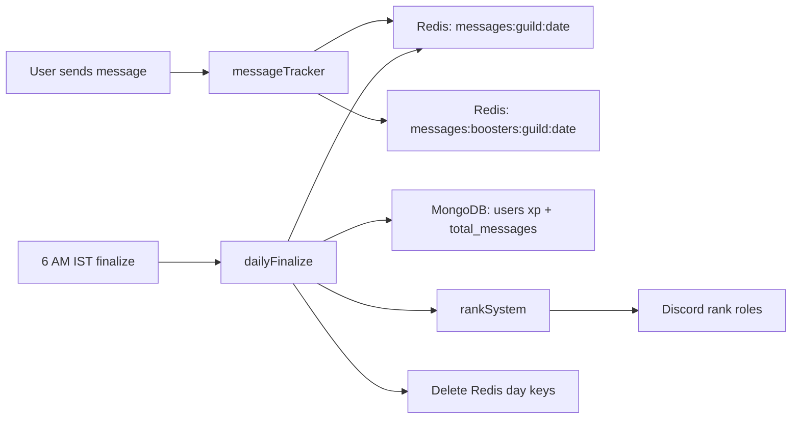
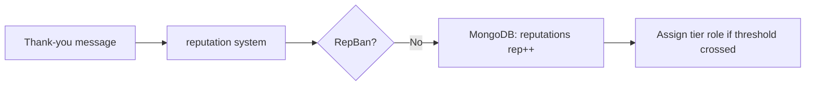
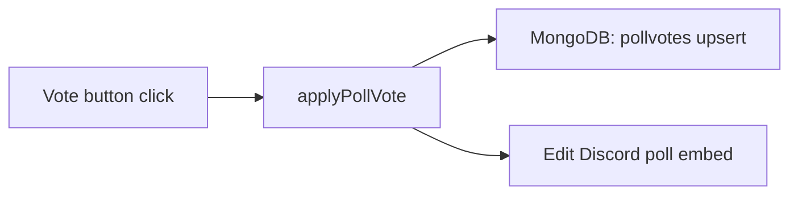

# Database

This document covers all MongoDB collections and Redis keys used by the r/alevel bot, plus how data flows between them.

---

## Overview

| Store | Client | Purpose |
|-------|--------|---------|
| **MongoDB** | Mongoose (`database.js`) | All durable data — users, rep, polls, mod logs, etc. |
| **Redis** | ioredis (`redis.js`) | Hot-path message counters and daily finalize locks only |

MongoDB connection: `MONGO_URI` env var.

Redis connection: `REDIS_URL` env var (required at startup).

---

## MongoDB

### Connection and seeding

```javascript
// database.js
await mongoose.connect(process.env.MONGO_URI);
await seedCounters(); // pollId, confessionId, taskId
console.log("✅ MongoDB Connected");
```

On connect, atomic ID counters are seeded from the max existing record in each collection. This prevents ID collisions after restarts.

| Counter name | Seeded from |
|-------------|-------------|
| `pollId` | Max `pollId` in `Poll` collection |
| `confessionId` | Max `confessionId` in `Confession` collection |
| `taskId` | Max numeric part of `taskId` in `Task` collection (e.g. `TSK-42` → 42) |

Counter documents live in the `counters` collection:

```javascript
{ _id: "pollId", seq: 15 }
```

New IDs are generated via `utils/getNextSequenceId.js`, `utils/getNextPollId.js`, `utils/getNextConfessionId.js`.

---

## Collections (18 models)

### `users` — User

**Model:** `models/User.js`

Tracks message activity and XP per Discord user.

| Field | Type | Description |
|-------|------|-------------|
| `_id` | String | Discord user ID |
| `guild_id` | String | Discord server ID (indexed) |
| `total_messages` | Number | Lifetime message count (default 0) |
| `xp` | Number | Total XP (default 0) |
| `createdAt` / `updatedAt` | Date | Auto timestamps |

**Written by:** `utils/dailyFinalize.js` (daily bulkWrite from Redis)

**Read by:** Rank system, XP-related commands

---

### `reputations` — Reputation

**Model:** `models/reputation.js`

| Field | Type | Description |
|-------|------|-------------|
| `userId` | String | Discord user ID (unique, indexed) |
| `rep` | Number | Reputation points (default 0) |
| `createdAt` / `updatedAt` | Date | Auto timestamps |

**Written by:** `systems/reputation.js` (automatic), rep commands (`/add-rep`, `/set-rep`, etc.)

**Read by:** Rep commands, `/leaderboard`

---

### `repbans` — RepBan

**Model:** `models/repban.js`

| Field | Type | Description |
|-------|------|-------------|
| `userId` | String | Banned user ID (unique, indexed) |
| `reason` | String | Ban reason |
| `createdAt` / `updatedAt` | Date | Auto timestamps |

**Written by:** `/rep-ban`, `/rep-unban`

**Read by:** `systems/reputation.js` (checks before awarding rep)

---

### `stickies` — Sticky

**Model:** `models/sticky.js`

| Field | Type | Description |
|-------|------|-------------|
| `guildId` | String | Server ID (indexed) |
| `channelId` | String | Channel ID (unique — one sticky per channel) |
| `content` | String | Sticky message text (Markdown) |
| `lineThreshold` | Number | Messages before repost (default 8) |
| `lastMessageId` | String | Bot's current sticky message ID |
| `enabled` | Boolean | Active flag (default true) |

**Written by:** Sticky slash commands, `systems/sticky.js` (lastMessageId flush)

**Read by:** `systems/sticky.js` (cache on ready)

---

### `stickylogs` — StickyLog

**Model:** `models/stickyLog.js`

Audit trail for sticky moderation actions.

| Field | Type | Description |
|-------|------|-------------|
| `guildId` | String | Server ID |
| `channelId` | String | Channel ID |
| `moderatorId` | String | Who performed the action |
| `moderatorTag` | String | Moderator username |
| `action` | String | `ADD`, `EDIT`, `REMOVE`, or `RESEND` |
| `content` | String | Sticky content at time of action |
| `lineThreshold` | Number | Threshold at time of action |

**Written by:** `utils/logStickyAction.js` (called from sticky commands)

---

### `polls` — Poll

**Model:** `models/poll.js`

| Field | Type | Description |
|-------|------|-------------|
| `pollId` | Number | Sequential poll ID (unique, indexed) |
| `guildId` | String | Server ID |
| `channelId` | String | Channel where poll is posted |
| `messageId` | String | Discord message ID of poll embed |
| `question` | String | Poll question |
| `options` | Array | `[{ id, label }]` |
| `allowedRoleIds` | Array | Roles that can vote |
| `choiceType` | String | `single` or `multiple` |
| `status` | String | `active` or `closed` |
| `deadline` | Date | Auto-close time (nullable) |
| `createdBy` | String | Creator user ID |
| `votes` | Array | Legacy embedded votes (new votes in PollVote) |

**Indexes:** `{ status: 1, deadline: 1 }`

**Written by:** `/poll` command, `systems/polls.js` (close)

---

### `pollvotes` — PollVote

**Model:** `models/pollVote.js`

| Field | Type | Description |
|-------|------|-------------|
| `pollId` | Number | Reference to poll |
| `userId` | String | Voter user ID |
| `optionIds` | Array | Selected option IDs |
| `updatedAt` | Date | Last vote time |

**Index:** `{ pollId: 1, userId: 1 }` unique compound

**Written by:** `utils/applyPollVote.js` (via poll button interactions)

---

### `confessions` — Confession

**Model:** `models/confession.js`

| Field | Type | Description |
|-------|------|-------------|
| `confessionId` | Number | Sequential ID (unique, indexed) |
| `content` | String | Confession text |
| `attachment` | String | Optional attachment URL |
| `allowReply` | Boolean | Whether replies are allowed |
| `status` | String | `PENDING`, `APPROVED`, or `REJECTED` |
| `authorId` | String | Submitter (stored but not shown publicly) |
| `modActionBy` | String | Moderator who approved/rejected |
| `rejectionReason` | String | Reason if rejected |
| `threadId` | String | Discord thread for replies |
| `postedMessageId` | String | Message ID in vent channel |
| `reviewedAt` | Date | When mod action was taken |

**Written by:** `/confess`, `systems/confessions.js`

---

### `confessionbans` — ConfessionBan

**Model:** `models/confessionBan.js`

| Field | Type | Description |
|-------|------|-------------|
| `userId` | String | Banned user (unique) |
| `bannedBy` | String | Moderator who banned |
| `reason` | String | Ban reason |
| `bannedAt` | Date | When banned |

---

### `certificateapplications` — CertificateApplication

**Model:** `models/certificate.js`

| Field | Type | Description |
|-------|------|-------------|
| `userId` | String | Applicant Discord ID |
| `userTag` | String | Applicant username |
| `type` | String | Certificate type requested |
| `status` | String | `pending` → `approved` → `details submitted` → `completed and delivered` (or `rejected`) |
| `reason` | String | Application reason |
| `moderatorId` | String | Approving/rejecting mod |
| `legalName` | String | Name for certificate |
| `email` | String | Delivery email |
| `certLink` | String | Link to delivered certificate |
| `certId` | String | Certificate ID |
| `rep` | Number | Applicant rep at time of application |
| `joinedAt` | Date | Applicant join date |
| `createdAt` / `resolvedAt` / `deliveredAt` | Date | Workflow timestamps |

**Written by:** `systems/certificates.js`, certificate commands

---

### `qotdrotations` — QotdRotation

**Model:** `models/qotdRotation.js`

| Field | Type | Description |
|-------|------|-------------|
| `guildId` | String | Server ID (unique) |
| `modOrder` | Array | `[{ id, tag }]` rotation list |
| `currentIndex` | Number | Current mod in rotation |
| `lastReminderDate` | String | `YYYY-MM-DD` IST — prevents duplicate daily sends |
| `enabled` | Boolean | Whether rotation is active |

**Written by:** `systems/qotd.js`, `/qotd-status` command

---

### `counters` — Counter

**Model:** `models/counter.js`

| Field | Type | Description |
|-------|------|-------------|
| `_id` | String | Counter name (`pollId`, `confessionId`, `taskId`) |
| `seq` | Number | Current sequence value |

**Used by:** `utils/getNextSequenceId.js` for atomic ID generation

---

### `modlogs` — ModLog

**Model:** `models/modlog.js`

Broad audit log for all moderation actions.

| Field | Type | Description |
|-------|------|-------------|
| `userId` | String | Target user (indexed) |
| `moderatorId` | String | Acting moderator |
| `action` | String | Action type: `warn`, `ban`, `role-add`, etc. |
| `reason` | String | Action reason |
| `actionId` | String | Unique action UUID |
| `targetTag` | String | Target username |
| `channelId` | String | Related channel |
| `metadata` | Object | Extra info (role, duration, etc.) |
| `timestamp` | Date | When action occurred (indexed) |

**Indexes:** `{ userId: 1, timestamp: -1 }`, `{ moderatorId: 1, timestamp: -1 }`

**Written by:** `utils/logModAction.js` (called from moderation commands)

---

### `warnings` — Warning

**Model:** `models/warning.js`

| Field | Type | Description |
|-------|------|-------------|
| `userId` | String | Warned user (indexed) |
| `userTag` | String | Username at time of warn |
| `moderatorId` | String | Moderator who warned |
| `reason` | String | Warning reason |
| `actionId` | String | Unique ID (unique) |
| `active` | Boolean | Whether warning is active (default true) |
| `delReason` | String | Reason if deleted |
| `timestamp` | Date | When warned |

**Written by:** `/warn`, deleted by `/delete-warning`, `/clear-warnings`

---

### `notes` — Note

**Model:** `models/note.js`

Staff notes on users (separate from warnings).

| Field | Type | Description |
|-------|------|-------------|
| `userId` | String | Target user (indexed) |
| `authorId` | String | Staff who wrote the note |
| `content` | String | Note text |
| `actionId` | String | Unique ID |
| `timestamp` | Date | When created |

**Written by:** `/note`, read by `/get-notes`

---

### `kicks` — Kick

**Model:** `models/kick.js`

| Field | Type | Description |
|-------|------|-------------|
| `userId` | String | Kicked user |
| `moderatorId` | String | Moderator |
| `reason` | String | Kick reason |
| `actionId` | String | Unique ID |
| `targetTag` | String | Username |
| `timestamp` | Date | When kicked |

**Written by:** `/kick` command

---

### `tasks` — Task

**Model:** `models/task.js`

| Field | Type | Description |
|-------|------|-------------|
| `taskId` | String | e.g. `TSK-42` (unique) |
| `title` | String | Task title |
| `description` | String | Task description |
| `team` | String | `graphic`, `dev`, or `writer` |
| `createdBy` | String | Creator user ID |
| `assignedTo` | Array | User IDs who claimed |
| `finishedBy` | Array | User IDs who finished |
| `finishedLinks` | Array | Submission links |
| `selected` | String | Selected designer (graphic/writer) |
| `status` | String | `open`, `claimed`, or `completed` |
| `resolution` | String | Graphic: resolution requirement |
| `fileFormat` | String | Graphic: file format |
| `fileNameFormat` | String | Graphic: naming convention |
| `notes` | String | Extra notes |
| `wordLimit` | String | Writer: word limit |
| `deadline` | String | Deadline text |
| `createdAt` | Date | Creation time |

**Written by:** Task commands (`/add-task`, `/claim`, etc.)

---

### `helperroles` — HelperRole

**Model:** `models/helperRole.js`

| Field | Type | Description |
|-------|------|-------------|
| `channelId` | String | Channel ID (unique) |
| `roleId` | String | Helper role to ping |

**Written by:** `/sethelper`, read by `/helper`

---

## Redis keys

Redis is used **only** for high-frequency message counting and finalize locking. No general-purpose caching.

### Current key patterns

| Key pattern | Type | Written by | Read by | TTL |
|-------------|------|------------|---------|-----|
| `messages:{guildId}:{date}` | Hash | `messageTracker` (`HINCRBY`) | `dailyFinalize` | Deleted after finalize |
| `messages:boosters:{guildId}:{date}` | Hash | `messageTracker` (`HSET`) | `dailyFinalize` | Deleted after finalize |
| `processed:{guildId}:{date}` | String | `dailyFinalize` (`SET NX EX`) | `dailyFinalizeSystem` | 1h processing / 7d completed |

**Hash fields:**

- `messages:{guildId}:{date}` → `{ userId: messageCount }`
- `messages:boosters:{guildId}:{date}` → `{ userId: "true" | "false" }`

**Date format:** `YYYY-MM-DD` UTC (`new Date().toISOString().split("T")[0]`)

**Finalize date:** Yesterday's date — finalize at 6 AM IST processes the previous day's counts.

### Legacy key patterns (fallback in dailyFinalize)

| Key pattern | Type | Purpose |
|-------------|------|---------|
| `messages:users:{guildId}:{date}` | Set | Legacy user ID set |
| `messages:{guildId}:{date}:{userId}` | Hash | Legacy per-user `{ count, booster }` |

The finalize system reads aggregate hashes first, then falls back to legacy keys if empty.

### Lock behavior

```javascript
// Acquire lock (1 hour TTL while processing)
await redis.set(lockKey, "true", "EX", 3600, "NX");

// After successful finalize (7 day TTL — prevents re-processing)
await redis.expire(lockKey, 604800);

// Delete day keys after finalize
await redis.del(countKey, boosterKey, usersSetKey);
```

---

## Data flow

### Message tracking → XP



### Reputation (immediate, no Redis)



### Poll votes



---

## Manual operations

### Flush Redis to MongoDB (without XP/ranks)

```bash
node utils/flushRedisToMongo.js
```

One-shot flush of today's message counts. Does not update XP or assign rank roles. Useful for debugging.

### Inspect Redis keys

```bash
redis-cli
KEYS messages:*
HGETALL messages:1430847370807083132:2026-06-20
GET processed:1430847370807083132:2026-06-19
```

### Inspect MongoDB

Use MongoDB Atlas UI or `mongosh`:

```javascript
db.users.find().sort({ xp: -1 }).limit(10)
db.reputations.find().sort({ rep: -1 }).limit(10)
db.counters.find()
```

---

## Related docs

- [Systems](systems.md) — how each system reads/writes data
- [Architecture](architecture.md) — data flow overview
- [Environment Variables](environment-variables.md) — `MONGO_URI`, `REDIS_URL`
- [Troubleshooting](troubleshooting.md) — database connection issues
