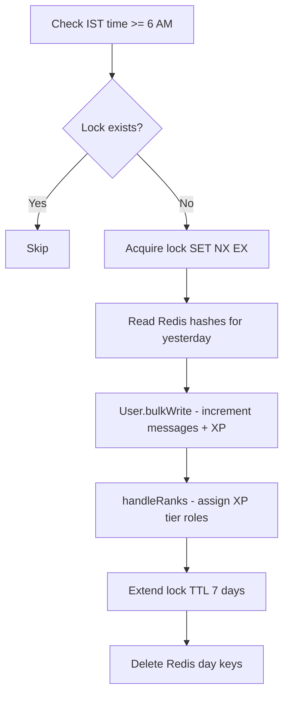

# Systems

This document describes every background system in the r/alevel bot — what it does, which files are involved, how it works internally, and what it depends on.

All systems are initialized from `index.js`. There is no separate `events/` or `jobs/` folder.

---

## System overview

| System | File(s) | Trigger | Storage |
|--------|---------|---------|---------|
| Command loader | `systems/commands.js` | `InteractionCreate` (slash) | In-memory Collection |
| Message router | `systems/messageRouter.js` | `MessageCreate` | — |
| Message tracker | `systems/messageTracker.js` | Called by router | Redis |
| Reputation | `systems/reputation.js` | Called by router | MongoDB |
| Sticky | `systems/sticky.js` | Called by router + `ready` | MongoDB + cache |
| Daily finalize | `systems/dailyFinalizeSystem.js`, `utils/dailyFinalize.js` | 5 min interval | Redis → MongoDB |
| Rank system | `systems/rankSystem.js` | Called by finalize | Discord roles |
| QOTD | `systems/qotd.js`, `utils/qotdHelpers.js` | 5 min interval | MongoDB + cache |
| Polls | `systems/polls.js`, `utils/applyPollVote.js`, `utils/pollSweeper.js` | Buttons + adaptive sweeper | MongoDB |
| Welcome | `systems/welcome.js` | `guildMemberAdd` | Canvas image |
| Certificates | `systems/certificates.js` | Buttons/modals | MongoDB |
| Confessions | `systems/confessions.js` | Buttons/modals | MongoDB |

---

## Background job schedule

| Job | Interval | Condition | Handler |
|-----|----------|-----------|---------|
| Daily finalize | 5 min + 10s on startup | ≥ 6:00 AM IST, Redis lock absent | `dailyFinalizeSystem.js` |
| QOTD reminder | 5 min + 10s on startup | ≥ 6:00 AM IST, not sent today; skips MongoDB before cutoff | `qotd.js` |
| Poll deadline sweeper | Adaptive (5 min idle cap) + 10s on startup | `deadline <= now` | `utils/pollSweeper.js` |
| Sticky `lastMessageId` flush | Debounced 5s | After sticky repost | `sticky.js` |
| Sticky shutdown flush | `SIGINT` / `SIGTERM` | Process exit | `sticky.js` |

No cron library is used — all timing is `setInterval` / `setTimeout` with manual IST checks.

---

## 1. Command loader

**File:** `systems/commands.js`

**Purpose:** Recursively loads all slash commands from `commands/` and routes `InteractionCreate` events with permission and hierarchy checks.

**Discord events:** `interactionCreate` (chat input commands only)

**Internal flow:**

1. Scan every subdirectory of `commands/`
2. Require each `.js` file; if it exports `data` + `execute`, add to `client.commands`
3. On slash command:
   - Check `permissions.config.js` for allowed roles
   - Run role hierarchy checks for moderation commands
   - Call `command.execute(interaction)` with error handling

**Hierarchy commands** (target user checked against moderator's highest role):

```javascript
const HIERARCHY_TARGET_OPTIONS = {
  warn: "user", kick: "user", ban: "user", softban: "user",
  timeout: "user", untimeout: "user", "clear-warnings": "user",
  setnickname: "user", "add-role": "user", "remove-role": "user",
  purge: "target",
};
```

**Dependencies:** `permissions.config.js`, `utils/checkRoleHierarchy.js`, `utils/checkRoleAssignment.js`

---

## 2. Message router

**File:** `systems/messageRouter.js`

**Purpose:** Single `MessageCreate` listener that fans out to tracker, sticky, and reputation handlers in parallel.

**Discord events:** `MessageCreate`

**Internal flow:**

```javascript
client.on(Events.MessageCreate, async (message) => {
  if (message.author.bot || !message.guild) return;

  const tasks = [handleMessageTracker(message), handleSticky(message)];
  if (!isReputationDisabled(message)) {
    tasks.push(handleReputation(message));
  }
  await Promise.all(tasks);
});
```

**Reputation gating:** Skips reputation in channels/categories listed in `DISABLED_CHANNELS` / `DISABLED_CATEGORIES` env vars (or the matching guild config fields). Legacy `STAFF_CHANNEL_IDS` values are merged into `DISABLED_CHANNELS` on new configs.

**Dependencies:** Handlers injected from `index.js` — `messageTracker`, `sticky`, `reputation`

**Verification:** `npm run verify:message-router`

---

## 3. Message tracker

**File:** `systems/messageTracker.js`

**Purpose:** Increment per-user daily message counts in Redis on every guild message.

**Trigger:** Called by message router (not a direct Discord listener)

**Internal flow:**

```javascript
const countKey = `messages:${guildId}:${date}`;       // Hash: userId → count
const boosterKey = `messages:boosters:${guildId}:${date}`; // Hash: userId → "true"/"false"

pipeline.hincrby(countKey, userId, 1);
pipeline.hset(boosterKey, userId, isBooster ? "true" : "false");
pipeline.expire(countKey, MESSAGE_KEY_TTL_SEC);   // 72h sliding TTL
pipeline.expire(boosterKey, MESSAGE_KEY_TTL_SEC);
```

- Date format: `YYYY-MM-DD` UTC (`toISOString().split("T")[0]`)
- Booster detection: checks `BOOSTER_ROLE_ID` on message author's roles
- Four Redis commands per message via a single pipeline (`HINCRBY`, `HSET`, `EXPIRE` × 2) — one network round trip
- Key TTL: 72 hours (refreshed on each message); keys are also deleted after daily finalize

**Dependencies:** `redis.js`, `BOOSTER_ROLE_ID`

**Downstream:** Data consumed by `utils/dailyFinalize.js` at 6 AM IST

**Verification:** `npm run verify:message-tracker`

---

## 4. Reputation system

**File:** `systems/reputation.js`

**Purpose:** Automatically award reputation when users say thank-you or you're-welcome in replies or mentions.

**Trigger:** Called by message router (returns `handleReputationMessage`, not a direct listener)

**Award paths:**

1. User replies to someone with a thank phrase → recipient gets +1 rep
2. User says thanks and @mentions users → each mentioned user gets +1 rep
3. User replies "yw"/"welcome"/"np" to a thank → original thanker gets +1 rep

**Tier roles** (assigned when rep crosses threshold):

| Rep | Role env var |
|-----|-------------|
| 10+ | `ROLE_BEGINNER_ROLE_ID` |
| 50+ | `INTERMEDIATE_ROLE_ID` |
| 100+ | `ADVANCED_ROLE_ID` |
| 500+ | `EXPERT_ROLE_ID` |
| 1000+ | `GIGACHAD_ROLE_ID` |

On tier-up, removes old tier roles and announces in channel.

**Internal details:**

- Checks `RepBan` collection — banned users cannot receive rep
- Automatic rep awards use atomic MongoDB `$inc` (no read-modify-save); mention-based thanks batch ban checks and increments via `bulkWrite`, then send one combined confirmation message
- Tier role sync uses the rep total from the award step (no second DB read)
- Keeps a bounded in-memory `processedMessageIds` cache (10k entries, FIFO eviction) to prevent double-processing
- Uses `utils/assignRepRole.js` for manual rep commands

**Verification:** `npm run verify:reputation`

**Dependencies:** MongoDB (`Reputation`, `RepBan`), tier role env vars, optional channel/category blocklist

---

## 5. Sticky system

**File:** `systems/sticky.js`

**Purpose:** Repost a configured message at the bottom of a channel after N new messages (default 8 lines).

**Discord events:** `ready` (load cache), `MessageCreate` (via router), `SIGINT`/`SIGTERM` (flush)

**Internal flow:**

1. On `ready`: load all enabled stickies from MongoDB into `client.stickies` Map
2. On each message: increment per-channel line counter in memory
3. When counter ≥ `lineThreshold`: delete old sticky bot message, repost content, reset counter
4. Queue `lastMessageId` write to MongoDB (debounced 5 seconds)

**Cache structure:**

```javascript
client.stickies = Map<channelId, { content, lineThreshold, lastMessageId, enabled }>
```

**Exports for slash commands:** `upsertStickyCache`, `removeStickyCache`

**Dependencies:** MongoDB (`Sticky`, `StickyLog` via commands), `utils/logStickyAction.js`

---

## 6. Daily finalize system

**Files:** `systems/dailyFinalizeSystem.js`, `utils/dailyFinalize.js`

**Purpose:** Once daily at 6:00 AM IST, flush yesterday's Redis message counts to MongoDB, update XP, and assign rank roles.

**Schedule:** Checks every 5 minutes; runs finalize when IST hour ≥ 6 and Redis lock is absent.

**Internal flow:**



**XP formula:**

```
xpGained = isBooster ? messageCount * 2 : messageCount
```

**Lock key:** `processed:{guildId}:{date}` — prevents double finalize

**Dependencies:** `redis.js`, `GUILD_ID`, MongoDB (`User`), `systems/rankSystem.js`

**Verification:** `npm run verify:finalize`

**Manual flush:** `utils/flushRedisToMongo.js` — one-shot flush without XP or rank updates

---

## 7. Rank system

**File:** `systems/rankSystem.js`

**Purpose:** Assign XP-based rank roles after daily finalize. Not bootstrapped directly in `index.js` — only called from `utils/dailyFinalize.js`.

**Rank thresholds** (hardcoded role IDs in `RANKS` array):

| XP | Level |
|----|-------|
| 0 | Level 1 |
| 20 | Level 2 |
| 100 | Level 3 |
| 250 | Level 4 |
| 500 | Level 5 |
| 1000 | Level 6 |
| 2500 | Level 7 |
| 5000 | Level 8 |
| 10000 | Level 9 |
| 15000 | Level 10 |
| 20000 | Level 11 |
| 30000 | Level 12 |
| 50000 | Level 13 |
| 75000 | Level 14 |
| 100000 | Level 15 |

**Internal flow:**

1. Compare each user's new XP vs previous XP
2. If rank tier changed: remove all rank roles, add new one
3. Announce in `LEVELUP_CHANNEL_ID` (batched, concurrency 5)

**Dependencies:** `LEVELUP_CHANNEL_ID`, Discord role IDs in `RANKS` array

**Verification:** `npm run verify:rank`

---

## 8. QOTD (Question of the Day)

**Files:** `systems/qotd.js`, `utils/qotdHelpers.js`

**Purpose:** Send a daily reminder at 6 AM IST to the assigned moderator to post the Question of the Day.

**Schedule:** Checks every 5 minutes after `ready`.

**Internal flow:**

1. Short-circuit if IST hour &lt; 6 (no MongoDB query before cutoff)
2. Load active `QotdRotation` from in-memory cache (30 min TTL) or MongoDB on cache miss
3. If reminder not sent today (`lastReminderDate`), send to `QOTD_REMINDER_CHANNEL_ID`
4. Advance `currentIndex`, save to MongoDB, refresh cache

**Dependencies:** `QOTD_REMINDER_CHANNEL_ID`, MongoDB (`QotdRotation`)

**Diagnostics:** `/qotd-status` uses `getQotdDiagnostics()` with `bypassCache: true` for live MongoDB state

**Verification:** `npm run verify:qotd`

---

## 9. Poll system

**Files:** `systems/polls.js`, `utils/pollSweeper.js`, `utils/applyPollVote.js`, `utils/getPollVotes.js`, `utils/pollDisplay.js`

**Purpose:** Handle poll vote buttons and automatically close expired polls.

**Discord events:** `InteractionCreate` (buttons: `poll_vote:*`, `poll_results:*`)

**Internal flow — voting:**

1. User clicks vote button → `applyPollVote` upserts `PollVote` document
2. Edit poll message embed with updated counts

**Internal flow — sweeper:**

```javascript
// Adaptive setTimeout chain (no fixed setInterval)
// Idle cap: 5 minutes when no active deadlines
// After each sweep: schedule next run at min(msUntilNearestDeadline, 5 min)
sweepExpiredPolls → close expired polls in parallel (concurrency 5)
// Lazy close on vote/view; wakePollSweeper() on /poll create with deadline
```

**Dependencies:** MongoDB (`Poll`, `PollVote`), `utils/canViewPollBreakdown.js`

**Verification:** `npm run verify:poll-votes`, `npm run verify:poll-sweeper`

---

## 10. Welcome system

**File:** `systems/welcome.js`

**Purpose:** Send a welcome embed with a custom canvas image when a member joins.

**Discord events:** `guildMemberAdd`

**Internal flow:**

1. Fetch member avatar URL
2. Composite avatar onto cached `assets/welcome.png` background using `@napi-rs/canvas` (background loaded once at first join, then reused)
3. Send embed with image to `WELCOME_CHANNEL`

**Dependencies:** `WELCOME_CHANNEL`, `@napi-rs/canvas`, `assets/welcome.png`

**Verification:** `npm run verify:welcome`

---

## 11. Certificate system

**File:** `systems/certificates.js`

**Purpose:** Handle the full certificate application workflow via buttons and modals.

**Discord events:** `InteractionCreate` (buttons, modals)

**Workflow:**

1. User clicks Apply button in `APPLICATION_CHANNEL`
2. Modal collects certificate type and reason
3. Creates `CertificateApplication` in MongoDB (status: `pending`)
4. Posts review embed to `REVIEW_CHANNEL` with Approve/Reject buttons
5. Admin approves → status `approved`, posts to `CERT_UPDATES_CHANNEL`
6. User submits details via `/submit-cert-details` → status `details submitted`
7. Admin marks delivered via `/mark-cert-delivered` → status `completed and delivered`

**Dependencies:** `APPLICATION_CHANNEL`, `REVIEW_CHANNEL`, `CERT_UPDATES_CHANNEL`, `ADMIN_ROLE_ID`, `SR_HELPER_ROLE_ID`, MongoDB (`CertificateApplication`)

**Related commands:** See [Commands — Certificates](commands.md#certificates)

---

## 12. Confession system

**File:** `systems/confessions.js`

**Purpose:** Anonymous confession submission with mod approval workflow.

**Discord events:** `InteractionCreate` (modals, approve/reject buttons)

**Workflow:**

1. User runs `/confess` → modal for content
2. Creates `Confession` document (status: `PENDING`)
3. Posts to `MOD_ACTION_CHANNEL` with Approve/Reject buttons
4. Mod approves → posts to `VENT_CHANNEL`, creates thread for replies
5. Mod rejects → DMs user with reason

**Dependencies:** `MOD_ACTION_CHANNEL`, `VENT_CHANNEL`, MongoDB (`Confession`, `ConfessionBan`)

**Known bug:** The approve handler references undefined `replyText` / `attachment` variables — the approve path may be broken. Fix before relying on it in production.

---

## 12. Task display board

**File:** `utils/taskDisplay.js`

**Purpose:** Maintain a pinned-style embed listing active tasks per team channel.

**Caching:** Each team's `displayMessageId` is stored in MongoDB (`TaskDisplay`) and mirrored in an in-memory `Map` keyed by `channelId`. Updates fetch the message by ID (one Discord API call); a 50-message channel scan runs only as a cold-start or recovery fallback when the stored ID is missing or deleted.

**Verification:** `npm run verify:task-display`

---

## Utility scripts (not wired into bot)

| Script | Purpose |
|--------|---------|
| `scripts/deploy-commands.js` | Register slash commands to Discord API |
| `scripts/migrateWarnings.js` | One-off warning data migration |
| `scripts/leaderboard.py` | Offline MEE6 leaderboard utility (Python, not part of Node bot) |
| `scripts/verify-*.js` | System verification tests |

---

## Related docs

- [Architecture](architecture.md) — startup flow and component communication
- [Database](database.md) — MongoDB collections and Redis keys
- [Environment Variables](environment-variables.md) — configuration reference
- [Troubleshooting](troubleshooting.md) — common system issues
