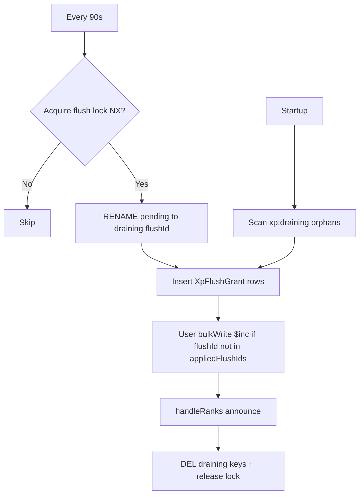

# Systems

This document describes every background system in the r/alevel bot — what it does, which files are involved, how it works internally, and what it depends on.

All systems are initialized from `index.js`. There is no separate `events/` or `jobs/` folder.

---

## System overview

| System | File(s) | Trigger | Storage |
|--------|---------|---------|---------|
| Command loader | `systems/commands.js` | `InteractionCreate` (slash) | In-memory Collection |
| Message router | `systems/messageRouter.js` | `MessageCreate` | — |
| Message tracker | `systems/messageTracker.js` | Called by router | Redis |
| Reputation | `systems/reputation.js` | Called by router | MongoDB |
| Sticky | `systems/sticky.js` | Called by router + `ready` | MongoDB + cache |
| XP flush | `systems/xpFlushSystem.js`, `utils/xpFlush.js` | 90s interval | Redis → MongoDB |
| Rank system | `systems/rankSystem.js` | Called by XP flush | Discord roles |
| QOTD | `systems/qotd.js`, `utils/qotdHelpers.js` | 5 min interval | MongoDB + cache |
| Polls | `systems/polls.js`, `utils/applyPollVote.js`, `utils/pollSweeper.js` | Buttons + adaptive sweeper | MongoDB |
| Welcome | `systems/welcome.js` | `guildMemberAdd` | Canvas image |
| Certificates | `systems/certificates.js` | Buttons/modals | MongoDB |
| Cert reminders | `systems/certReminders.js` | 5 min interval | MongoDB |
| Cert forfeit sweeper | `systems/certForfeitSweeper.js` | 5 min interval | MongoDB |
| Confessions | `systems/confessions.js` | Buttons/modals | MongoDB |
| Modmail | `systems/modmail.js` | Called by router + `/close-ticket` / blacklist commands | MongoDB |
| Moderator DMs | `systems/modDm.js` | Called by router + `/dm` / `/close-dm` + buttons | MongoDB |
| Definitions | `systems/definitions.js`, `utils/definitions.js`, `utils/definitionActions.js` | `/define` family + buttons/modals | MongoDB |

---

## Background job schedule

| Job | Interval | Condition | Handler |
|-----|----------|-----------|---------|
| XP flush | 90s + 10s on startup | Redis lock absent; resumes orphan drains | `xpFlushSystem.js` |
| QOTD reminder | 5 min + 10s on startup | ≥ `qotdHourIst` IST, not sent today | `qotd.js` |
| Cert delivery reminders | 5 min + 15s on startup | ≥ `certificatesHourIst` IST, not sent today; skips forfeited / forfeit-scheduled | `certReminders.js` |
| Cert forfeit sweeper | 5 min + 20s on startup | ≥ `certificatesForfeitHourIst` IST, not run today; `forfeitAt <= now` | `certForfeitSweeper.js` |
| Poll deadline sweeper | Adaptive (5 min idle cap) + 10s on startup | `deadline <= now` | `utils/pollSweeper.js` |
| Sticky `lastMessageId` flush | Debounced 5s | After sticky repost | `sticky.js` |
| Sticky shutdown flush | `SIGINT` / `SIGTERM` | Process exit | `sticky.js` |

No cron library is used — all timing is `setInterval` / `setTimeout` with manual IST checks.

---

## 1. Command loader

**File:** `systems/commands.js`

**Purpose:** Recursively loads all slash commands from `commands/` and routes `InteractionCreate` events with permission and hierarchy checks.

**Discord events:** `interactionCreate` (chat input commands only)

**Internal flow:**

1. Scan every subdirectory of `commands/`
2. Require each `.js` file; if it exports `data` + `execute`, add to `client.commands`
3. On slash command:
   - Check `permissions.config.js` for allowed roles
   - Run role hierarchy checks for moderation commands
   - Call `command.execute(interaction)` with error handling

**Hierarchy commands** (target user checked against moderator's highest role):

```javascript
const HIERARCHY_TARGET_OPTIONS = {
  warn: "user", kick: "user", ban: "user", softban: "user",
  timeout: "user", untimeout: "user", "clear-warnings": "user",
  setnickname: "user", "add-role": "user", "remove-role": "user",
  purge: "target",
};
```

**Dependencies:** `permissions.config.js`, `utils/checkRoleHierarchy.js`, `utils/checkRoleAssignment.js`

---

## 2. Message router

**File:** `systems/messageRouter.js`

**Purpose:** Single `MessageCreate` listener that fans out to tracker, sticky, and reputation handlers in parallel. Also routes DMs and forum-thread messages to modmail and moderator DMs.

**Discord events:** `MessageCreate`

**Internal flow:**

```javascript
client.on(Events.MessageCreate, async (message) => {
  if (message.author.bot) return;
  if (!message.guild) {
    // An open moderator DM wins, so the user never sees the support menu mid-conversation.
    if (await handleModDmUserMessage?.(message)) return;
    await handleModmailDm?.(message);
    return;
  }
  if (await handleModmailStaffReply?.(message)) return;
  if (await handleModDmStaffReply?.(message)) return;

  // guild fan-out: tracker / sticky / reputation
});
```

**Reputation gating:** Skips reputation in channels/categories listed in `DISABLED_CHANNELS` / `DISABLED_CATEGORIES` env vars (or the matching guild config fields). Legacy `STAFF_CHANNEL_IDS` values are merged into `DISABLED_CHANNELS` on new configs.

**Dependencies:** Handlers injected from `index.js` — `messageTracker`, `sticky`, `reputation`, `modmail`, `modDm`

**Verification:** `npm run verify:message-router`

---

## 3. Message tracker

**File:** `systems/messageTracker.js`

**Purpose:** Increment per-user pending message counts in Redis on every guild message.

**Trigger:** Called by message router (not a direct Discord listener)

**Internal flow:**

```javascript
const countKey = `xp:pending:${guildId}`;       // Hash: userId → count
const boosterKey = `xp:boosters:${guildId}`;    // Hash: userId → "true"/"false"

pipeline.hincrby(countKey, userId, 1);
pipeline.hset(boosterKey, userId, isBooster ? "true" : "false");
pipeline.expire(countKey, PENDING_KEY_TTL_SEC);   // 7d sliding TTL
pipeline.expire(boosterKey, PENDING_KEY_TTL_SEC);
```

- Booster detection: checks configured booster role / `BOOSTER_ROLE_ID` on message author's roles
- Four Redis commands per message via a single pipeline (`HINCRBY`, `HSET`, `EXPIRE` × 2) — one network round trip
- Key TTL: 7 days (refreshed on each message); keys are renamed away during XP flush

**Dependencies:** `redis.js`, `utils/xpKeys.js`, `BOOSTER_ROLE_ID`

**Downstream:** Data consumed by `utils/xpFlush.js` every 90 seconds

**Verification:** `npm run verify:message-tracker`

---

## 4. Reputation system

**File:** `systems/reputation.js`

**Purpose:** Automatically award reputation when users say thank-you or you're-welcome in replies or mentions.

**Trigger:** Called by message router (returns `handleReputationMessage`, not a direct listener)

**Award paths:**

1. User replies to someone with a thank phrase → recipient gets +1 rep
2. User says thanks and @mentions users → each mentioned user gets +1 rep
3. User replies "yw"/"welcome"/"np" to a thank → original thanker gets +1 rep

**Tier roles** (assigned when rep crosses threshold):

| Rep | Role env var |
|-----|-------------|
| 10+ | `ROLE_BEGINNER_ROLE_ID` |
| 50+ | `INTERMEDIATE_ROLE_ID` |
| 100+ | `ADVANCED_ROLE_ID` |
| 500+ | `EXPERT_ROLE_ID` |
| 1000+ | `GIGACHAD_ROLE_ID` |

On tier-up, removes old tier roles and announces in channel.

**Internal details:**

- Checks `RepBan` collection — banned users cannot receive rep
- Automatic rep awards use atomic MongoDB `$inc` (no read-modify-save); mention-based thanks batch ban checks and increments via `bulkWrite`, then send one combined confirmation message
- Tier role sync uses the rep total from the award step (no second DB read)
- Keeps a bounded in-memory `processedMessageIds` cache (10k entries, FIFO eviction) to prevent double-processing
- Uses `utils/assignRepRole.js` for manual rep commands

**Verification:** `npm run verify:reputation`

**Dependencies:** MongoDB (`Reputation`, `RepBan`), tier role env vars, optional channel/category blocklist

---

## 5. Sticky system

**File:** `systems/sticky.js`

**Purpose:** Repost a configured message at the bottom of a channel after N new messages (default 8 lines).

**Discord events:** `ready` (load cache), `MessageCreate` (via router), `SIGINT`/`SIGTERM` (flush)

**Internal flow:**

1. On `ready`: load all enabled stickies from MongoDB into `client.stickies` Map
2. On each message: increment per-channel line counter in memory
3. When counter ≥ `lineThreshold`: delete old sticky bot message, repost content, reset counter
4. Queue `lastMessageId` write to MongoDB (debounced 5 seconds)

**Cache structure:**

```javascript
client.stickies = Map<channelId, { content, lineThreshold, lastMessageId, enabled }>
```

**Exports for slash commands:** `upsertStickyCache`, `removeStickyCache`

**Dependencies:** MongoDB (`Sticky`, `StickyLog` via commands), `utils/logStickyAction.js`

---

## 6. XP flush system

**Files:** `systems/xpFlushSystem.js`, `utils/xpFlush.js`, `utils/xpKeys.js`

**Purpose:** Every 90 seconds, drain pending Redis message counts into MongoDB via an idempotent grant ledger, update XP, and assign rank roles (with level-up announcements).

**Schedule:** `setInterval` every 90s; also resumes orphan drains and runs once ~10s after startup.

**Internal flow:**


```mermaid
flowchart TD
    A[Every 90s] --> B{Acquire flush lock NX?}
    B -->|No| SKIP[Skip]
    B -->|Yes| C[RENAME pending to draining flushId]
    C --> D[Insert XpFlushGrant rows]
    D --> E["User bulkWrite $inc if flushId not in appliedFlushIds"]
    E --> F[handleRanks announce]
    F --> G[DEL draining keys + release lock]
    H[Startup] --> I[Scan xp:draining orphans]
    I --> D
```

**XP formula:**

```
xpGained = isBooster ? messageCount * boosterMultiplier : messageCount
```

**Idempotency:** `XpFlushGrant` unique on `{ guildId, flushId, userId }`; User updates use `appliedFlushIds: { $nin: [flushId] }` so retries cannot double-count.

**Lock key:** `xp:flush:lock:{guildId}` (TTL 120s)

**Dependencies:** `redis.js`, `GUILD_ID`, MongoDB (`User`, `XpFlushGrant`, `XpBan`), `systems/rankSystem.js`

**Verification:** `npm run verify:xp-flush`

**Manual flush:** `utils/flushRedisToMongo.js` — one-shot call to the same idempotent `flushPendingXp` helper

---

## 7. Rank system

**File:** `systems/rankSystem.js`

**Purpose:** Assign XP-based rank roles after XP flush. Not bootstrapped directly in `index.js` — called from `utils/xpFlush.js` (and admin XP commands via `utils/xp.js`).

**Rank thresholds** (hardcoded role IDs in `RANKS` array):

| XP | Level |
|----|-------|
| 0 | Level 1 |
| 20 | Level 2 |
| 100 | Level 3 |
| 250 | Level 4 |
| 500 | Level 5 |
| 1000 | Level 6 |
| 2500 | Level 7 |
| 5000 | Level 8 |
| 10000 | Level 9 |
| 15000 | Level 10 |
| 20000 | Level 11 |
| 30000 | Level 12 |
| 50000 | Level 13 |
| 75000 | Level 14 |
| 100000 | Level 15 |

**Internal flow:**

1. Compare each user's new XP vs previous XP
2. If rank tier changed: remove all rank roles, add new one
3. Announce in `LEVELUP_CHANNEL_ID` (batched, concurrency 5)

**Dependencies:** `LEVELUP_CHANNEL_ID`, Discord role IDs in `RANKS` array

**Verification:** `npm run verify:rank`

---

## 8. QOTD (Question of the Day)

**Files:** `systems/qotd.js`, `utils/qotdHelpers.js`

**Purpose:** Send a daily reminder at 6 AM IST to the assigned moderator to post the Question of the Day.

**Schedule:** Checks every 5 minutes after `ready`.

**Internal flow:**

1. Short-circuit if IST hour &lt; `qotdHourIst` (no MongoDB query before cutoff)
2. Load active `QotdRotation` from in-memory cache (30 min TTL) or MongoDB on cache miss
3. If reminder not sent today (`lastReminderDate`), render `GuildConfig.qotd.reminderTemplate` (placeholders `{currentMention}`, `{nextMention}`, `{date}`, etc.) and send to the `qotdReminder` channel
4. Skip without advancing rotation if the rendered body is empty or over Discord’s 2000-character limit
5. Advance `currentIndex`, save to MongoDB, refresh cache

**Dependencies:** `qotdReminder` channel, MongoDB (`QotdRotation`, `GuildConfig.qotd.reminderTemplate`)

**Diagnostics:** `/qotd-status` uses `getQotdDiagnostics()` with `bypassCache: true` for live MongoDB state

**Verification:** `npm run verify:qotd`

---

## 9. Poll system

**Files:** `systems/polls.js`, `utils/pollSweeper.js`, `utils/applyPollVote.js`, `utils/getPollVotes.js`, `utils/pollDisplay.js`

**Purpose:** Handle poll vote buttons and automatically close expired polls.

**Discord events:** `InteractionCreate` (buttons: `poll_vote:*`, `poll_results:*`)

**Internal flow — voting:**

1. User clicks vote button → `applyPollVote` upserts `PollVote` document
2. Edit poll message embed with updated counts

**Internal flow — sweeper:**

```javascript
// Adaptive setTimeout chain (no fixed setInterval)
// Idle cap: 5 minutes when no active deadlines
// After each sweep: schedule next run at min(msUntilNearestDeadline, 5 min)
sweepExpiredPolls → close expired polls in parallel (concurrency 5)
// Lazy close on vote/view; wakePollSweeper() on /poll create with deadline
```

**Dependencies:** MongoDB (`Poll`, `PollVote`), `utils/canViewPollBreakdown.js`

**Verification:** `npm run verify:poll-votes`, `npm run verify:poll-sweeper`

---

## 10. Welcome system

**File:** `systems/welcome.js`

**Purpose:** Send a welcome embed with a custom canvas image when a member joins.

**Discord events:** `guildMemberAdd`

**Internal flow:**

1. Fetch member avatar URL
2. Composite avatar onto cached `assets/welcome.png` background using `@napi-rs/canvas` (background loaded once at first join, then reused)
3. Send embed with image to `WELCOME_CHANNEL`

**Dependencies:** `WELCOME_CHANNEL`, `@napi-rs/canvas`, `assets/welcome.png`

**Verification:** `npm run verify:welcome`

---

## 11. Certificate system

**File:** `systems/certificates.js`

**Purpose:** Handle the full certificate application workflow via buttons and modals.

**Discord events:** `InteractionCreate` (buttons, modals)

**Workflow:**

1. User clicks Apply button in `APPLICATION_CHANNEL`. If the button has `certificates.panel.buttons[].requiredRoleKeys` (editable at `/settings/certificates`), the user must hold **all** those roles or is told which are missing. Empty = no requirement (Helper defaults to `srHelper`).
2. Creates `CertificateApplication` in MongoDB (status: `pending`)
3. Posts review embed to `REVIEW_CHANNEL` with Approve/Reject buttons
4. Admin approves → status `approved`, DMs applicant (or `CERT_UPDATES_CHANNEL` fallback)
5. Admin records details via `/submit-cert-details` → status `details submitted`
6. Admin marks delivered via `/mark-cert-delivered` → status `completed and delivered`
7. Or admin schedules forfeit via `/mark-cert-finish` → after N days at `certificatesForfeitHourIst`, status becomes `forfeited` (auto-cancelled if the app progresses or via `/cancel-cert-forfeit`)

**Related systems:**
- `systems/certReminders.js` — daily IST reminders for undelivered apps (skips forfeited / forfeit-scheduled)
- `systems/certForfeitSweeper.js` — daily IST job that executes due forfeits

**Dependencies:** `APPLICATION_CHANNEL`, `REVIEW_CHANNEL`, `CERT_UPDATES_CHANNEL`, MongoDB (`CertificateApplication`, `CertRotation`), GuildConfig `schedules.certificatesHourIst` / `certificatesForfeitHourIst`

**Related commands:** See [Commands — Certificates](commands.md#certificates)

---

## 12. Confession system

**File:** `systems/confessions.js`

**Purpose:** Anonymous confession submission with mod approval workflow.

**Discord events:** `InteractionCreate` (modals, approve/reject buttons)

**Workflow:**

1. User runs `/confess` → modal for content
2. Creates `Confession` document (status: `PENDING`)
3. Posts to `MOD_ACTION_CHANNEL` with Approve/Reject buttons
4. Mod approves → posts to `VENT_CHANNEL`, creates thread for replies
5. Mod rejects → DMs user with reason

**Dependencies:** `MOD_ACTION_CHANNEL`, `VENT_CHANNEL`, MongoDB (`Confession`, `ConfessionBan`)

**Known bug:** The approve handler references undefined `replyText` / `attachment` variables — the approve path may be broken. Fix before relying on it in production.

---

## 13. Modmail

**File:** `systems/modmail.js`

**Purpose:** Intake + relay between user DMs and permanent staff forum posts. Forum channels and dropdown categories come from guild config (`modmail`), with `MOD_MAIL_CHANNEL_ID` / `ADMIN_MOD_MAIL_CHANNEL_ID` as env fallbacks. Categories can be toggled to the admin forum. Staff identity is hidden in the user DM only. Closed posts are archived (kept as a log), never deleted.

**Discord events:** Handled via `messageRouter` (`MessageCreate`) and `InteractionCreate` (select menu + modal); close via slash `/close-ticket`; blacklist via `/ban-user-modmail`, `/unban-user-modmail`, `/list-modmail-ban`

**Dashboard:** `/settings/modmail` — pick the normal and admin forum channels (from Channels registry) and edit support categories, including whether each category routes to admin modmail.

**Workflow:**

1. User DMs the bot with no open ticket → if they are on the modmail blacklist, they get a "Banned from Modmail" embed with the stored reason, a note to DM any server admin to request an unban, and no category dropdown. The ban is checked before the open-ticket lookup, so a banned user's DMs are never relayed (a stale open ticket is closed); otherwise GET SUPPORT with category dropdown (from guild config)
2. User picks a category → modal asks them to describe their problem (blacklist is checked again here and on modal submit)
3. On submit → create a new forum post in the normal modmail forum, or the admin forum if that category has **Route to admin modmail** enabled (opener embed with user + category, then description message), and DM the user a confirmation that quotes their explanation. Admin-routed tickets never fall back to the normal forum.
4. Further user DMs while the ticket is open relay into that post as embeds (one open ticket per user, in either forum)
5. Staff replies in the post relay anonymously to the user DM (label: Staff)
6. Messages starting with `.` stay staff-only (not relayed)
7. `/close-ticket` marks the ticket closed, DMs the user, and archives the post (works in both forums)
8. `/unban-user-modmail` removes the ban and DMs the user that they can use modmail again
9. `/ban-user-modmail` upserts a `ModmailBan` with a required reason, DMs the user, and auto-closes + archives any open ticket
10. After close, the next DM shows the support menu again (or the ban notice) and creates a **new** post only if they are not banned; the old post stays
11. While the user has an open moderator DM (see below), their DMs go to that conversation instead, and the support dropdown/modal refuses to open a ticket

**Dependencies:** Guild config `modmail` (or env `MOD_MAIL_CHANNEL_ID` / `ADMIN_MOD_MAIL_CHANNEL_ID`), optional booster role / `BOOSTER_ROLE_ID` (intake copy), MongoDB (`ModmailTicket`, `ModmailBan`), intents `DirectMessages` + partial `Channel`

**Related commands:** `/close-ticket`, `/ban-user-modmail`, `/unban-user-modmail`, `/list-modmail-ban`

---

## 13b. Moderator DMs

**File:** `systems/modDm.js`

**Purpose:** Lets mods start a private DM conversation with any member. Each user gets **one** forum post in the `modDm` forum, reused every time the conversation is reopened, so the full history stays in one place. Only the intro DM is an embed; the conversation itself is relayed both ways as **plain text**. Mods stay anonymous. Users can end the conversation or turn off moderator DMs at any time.

**Discord events:** Handled via `messageRouter` (`MessageCreate`) and `InteractionCreate` (buttons); open via `/dm`, close via `/close-dm` or the post's **Close conversation** button

**Dashboard:** Channels page — key `modDm` → the forum channel ID (env fallback `MOD_DM_CHANNEL_ID`). It must be a different forum from both modmail forums.

**Workflow:**

1. `/dm user [message]` refuses if the forum isn't configured, the target is a bot, the user turned off moderator DMs, a conversation is already open, or the user has an **open modmail ticket** (the reply links to it)
2. Otherwise it claims the conversation atomically, then reopens the user's existing post (or creates `dm-<username>`) and posts `🟢 Conversation opened by @mod`
3. The user gets an intro embed with **End conversation** and **Don't DM me again** buttons on the same message. If the DM fails (closed DMs / blocked bot), the claim is rolled back, a new post is deleted (a reused post gets a notice and is re-archived), and the mod is told
4. The optional `message` is sent as the first DM and echoed in the post
5. User DMs relay into the post; staff messages in the post relay to the user. Native replies map both ways (`ModmailMessageLink`). Mentions are always disabled, so `@everyone` from a user can never ping. Messages starting with `.` stay staff-only
6. If a staff message fails because the user's DMs are now closed (error 50007), the bot posts a warning in the post and closes + archives the conversation
7. `/close-dm [reason]` or the Close button closes the conversation, DMs the user (with reason and a **Don't DM me again** button), and archives the post. Staff messages sent in a closed post get a "not delivered" reply
8. **End conversation** closes it from the user side; stale buttons from an older conversation do nothing
9. **Don't DM me again** asks for confirmation, ends any open conversation, and sends a DM with an **Allow moderator DMs again** button. Opting out only affects `/dm`, not modmail or moderation notices (warn/ban/timeout DMs)

**Modmail interplay:** a user can't have both at once — `/dm` is refused during an open ticket, and ticket intake is refused during an open moderator DM. A user banned from modmail can still reply to a mod who DMs them.

**Dependencies:** Guild config channel `modDm` (or env `MOD_DM_CHANNEL_ID`), MongoDB (`ModDm`, `ModmailMessageLink`), modmail relay helpers, intents `DirectMessages` + partial `Channel`

**Related commands:** `/dm`, `/close-dm`

**Verification:** `npm run verify:mod-dm`

---

## 14. Moderation point system

**File:** `utils/modPoints.js` (auto-ban via `utils/banUser.js`, shared with `/ban`)

**Purpose:** Infractions give users points. Reaching the threshold **T** bans the user automatically, and every infraction that leaves them at **T − X** or more (but below T) adds a ban notice to their DM.

**Dashboard:** `/moderation/points` (settings, stored in GuildConfig `moderation.points`) and `/moderation/point-ledger` (entries + top users, void/restore). The whole system is off until **Enable the point system** is ticked.

**Settings:** threshold T, notice distance X, expiry days for each source (`warn` default 30, `timeout` / `kick` / `softban` / `manual` default 0 = never; stored on each entry as `expiresAt` when it is created, so changes only apply to new infractions), points per command (`warn`, `timeout`, `kick`, `softban`; 0 disables a command), auto-ban appealable + message-deletion window + reason template, ban notice template, and an optional points line added to infraction DMs. Placeholders are listed on the dashboard page (`MOD_POINTS_PLACEHOLDERS` in `@ralevel/shared`).

**Workflow (warn / timeout / kick / softban):**

1. `previewInfraction` works out the new total without writing anything
2. If the new total is below T: DM the user (with the points line and, in the notice zone, the ban notice), then run the action
3. If the new total reaches T: skip the infraction DM and the timeout / kick / softban itself, since the ban covers it
4. After the action succeeds, record a `ModPoint` entry (a failed timeout / kick / softban records nothing)
5. `enforceThreshold` bans the user using the ban DM templates from **Ban messages** and logs `points-autoban` to the mod log with the bot as moderator
6. The reply embed gets a **Points** field showing the new total and whether a notice or auto-ban happened

**Reversals:** `/delete-warning` and `/clear-warnings` void the points from those warnings, `/untimeout` voids the latest timeout entry, and `/unban` voids every entry for the user (they start again at 0). Voiding points never unbans anyone.

**Verification:** `npm run verify:mod-points`

---

## 15. Definitions

**Files:** `systems/definitions.js` (buttons/modals), `utils/definitions.js` (config, permissions, search, embeds), `utils/definitionActions.js` (writes, review requests, decisions)

**Purpose:** A subject glossary. `/define` looks terms up; `/add-define`, `/edit-define`, `/delete-define` and the **Suggest improvement** button change it, with a review queue for anyone without rights.

**Dashboard:** **Settings → Definitions** (GuildConfig `definitions` + `features.definitions`): subjects (name, stable ID, helper role keys, enabled), exam boards, review channel, optional log channel, approver roles, ping roles and the per-member pending cap. **Operations → Definitions** lists definitions (inline edit/delete) and the request history. Subjects/boards that still have definitions can't be removed — disable them instead (hidden from `/add-define`, still searchable).

**Who changes what directly:**

| Action | Approver | Subject helper | Everyone else |
|--------|----------|----------------|---------------|
| Add | Direct | Direct (own subjects) | Review |
| Edit / delete own definition | Direct | Direct | Review |
| Edit / delete someone else's | Direct | Review | Review |

Direct changes are logged to the log channel (or the review channel when unset) without a ping.

**Review workflow:**

1. A `DefinitionRequest` (`create`, `edit` or `delete`) is created and posted to the review channel with the ping roles mentioned
2. Approvers press **Approve**, **Edit & approve** (pre-filled form; not for deletions) or **Reject** (optional reason)
3. The request is claimed atomically (`status: "pending"` filter), so two reviewers can't both act; if applying fails it goes back to pending
4. The review message is updated with the outcome and the requester is DMed (ignored if their DMs are closed)

**Credits:** the author is whoever the definition was created for (the requester for reviewed additions). When an edit is applied, the person who wrote it is added to `contributors` unless they are the author; `/define` shows both.

**Stale edits:** each definition has a `revision`. An edit suggestion records the revision it was based on; plain **Approve** refuses it if the definition changed since, and **Edit & approve** applies it anyway. Edits to deleted definitions are closed as rejected.

**Custom IDs:** `definition:suggest:<definitionId>`, `definition:edit-modal:<definitionId>:<revision>`, `definition:{approve,review-edit,reject}:<requestId>`, `definition:{review-edit-modal,reject-modal}:<requestId>` — all state is in the ID and MongoDB, so buttons survive restarts.

**Seeding test data:** `pnpm --filter @ralevel/bot seed:definitions` (`--author=<user id>` to credit yourself, `--clear` to remove)

**Verification:** `npm run verify:definitions`

---

## 12. Task display board

**File:** `utils/taskDisplay.js`

**Purpose:** Maintain a pinned-style embed listing active tasks per team channel.

**Caching:** Each team's `displayMessageId` is stored in MongoDB (`TaskDisplay`) and mirrored in an in-memory `Map` keyed by `channelId`. Updates fetch the message by ID (one Discord API call); a 50-message channel scan runs only as a cold-start or recovery fallback when the stored ID is missing or deleted.

**Verification:** `npm run verify:task-display`

---

## Utility scripts (not wired into bot)

| Script | Purpose |
|--------|---------|
| `scripts/deploy-commands.js` | Register slash commands to Discord API |
| `scripts/migrateWarnings.js` | One-off warning data migration |
| `scripts/leaderboard.py` | Offline MEE6 leaderboard utility (Python, not part of Node bot) |
| `scripts/verify-*.js` | System verification tests |

---

## Related docs

- [Architecture](architecture.md) — startup flow and component communication
- [Database](database.md) — MongoDB collections and Redis keys
- [Environment Variables](environment-variables.md) — configuration reference
- [Troubleshooting](troubleshooting.md) — common system issues
